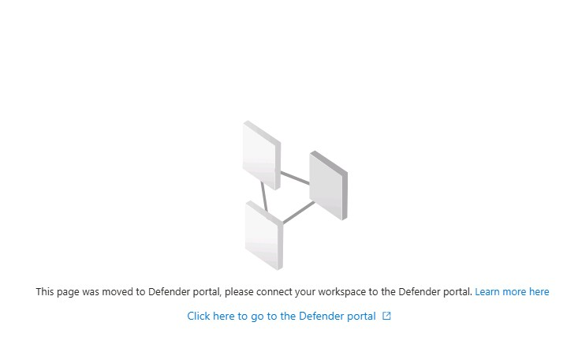

# SC-200T00-Defend against cyberthreats with Microsoft's security operations platform - Errata All Learning Paths and Days
# SC-200T00-Defend against cyberthreats with Microsoft's security operations platform - Errata Day 1 Labs
# Ensure you choose "SAVE" if you do not finish all 4 labs - so as not to lose your work
## Learning Path 1 - Lab 1 - Explore Microsoft Defender XDR (~30 Minutes)
### Exercise 1 - Explore Microsoft Defender XDR

Task 2: Apply Microsoft Defender for Office 365 preset security policies 
#### Note: If presented with Sign in to Microsoft Edge select No,thanks  

Step 12:  Your Domain name can be found in the Resources dropdown listed as Tenant Name 

## Learning Path 2 - Lab 1 - Explore Microsoft Security Copilot (~45 Minutes)
### Exercise 1 - Explore Microsoft Security Copilot

Task 1: Provision Microsoft Security Copilot
Step 2: Right click on the link and copy link address > open a new browser tab > use the type text feature the instructor demod 

Task 2: Explore the Microsoft Security Copilot standalone experience 
Sub-task 1: Explore the menu options 
Step 5c:  Make sure you slide the slider bar to the right 

## Learning Path 3 - Mitigate threats using Microsoft Purview (~15 Minutes)

### Exercise 1 - Explore Microsoft Purview Audit logs 
Task 1: Enable Purview Audit logs 
Step 6: From the navigation menu, select More resources 
Step 9: click Get started 
Step 12:  It could take up to 60 minutes for the recordings to start. The blue bar will not disappear until it has started.  You can move on to the next lab.  

## Learning Path 4 - Lab 1 - Deploy Microsoft Defender for Endpoint (~60 Minutes)
### Exercise 1 - Deploy Microsoft Defender for Endpoint

Before starting the lab, close the browser   

### Exercise 2 - Mitigate Attacks with Microsoft Defender for Endpoint

Task 1: Verify Device onboarding 
Step 3: You may need to log out, close and reopen the browser and log back in to see Endpoints 

# SC-200T00-Defend against cyberthreats with Microsoft's security operations platform - Errata Day 2 Labs
## Learning Path 5 - Lab 01 – Enable Microsoft Defender for Cloud (~40 Minutes)
### Exercise 1 – Enable Microsoft Defender for Cloud
Task 1: Connect an On-Premises Server  
Step 4: Paste command in notepad > update the subscritption > paste into Command Prompt  

### Exercise 2 - Mitigate threats using Microsoft Defender for Cloud
Task 2: Explore Security Recommendations  
Due to the limitations of the lab there may be no recommedations listed > skip to next Task  

## Learning Path 6 - Lab 01 – Create queries for Microsoft Sentinel using Kusto Query Language (KQL) (~60 Minutes)
#### NOTE: This lab will take at least 25 minutes to launch..... this is a good time to take a break
### Exercise 1 - Create queries for Microsoft Sentinel using Kusto Query Language (KQL)
Task 1: Prepare the KQL testing area  
Wait for the deployment to finish  

# SC-200T00-Defend against cyberthreats with Microsoft's security operations platform - Errata Day 3 Labs
## Learning Path 7 - Lab 01 – Configure your Microsoft Sentinel environment (~30 Minutes)
### Exercise 1 - Configure your Microsoft Sentinel environment
Task 4: Create a Watchlist 
Step 18: It will take at least 10 Minutes for the Watchlist to function even though it will be listed 

Task 5: Create a Threat Indicator 
Task 5: Create a Threat Indicator  
#### Note you may not be able to complete this task.  Threat indicators are being move from Sentinel to Microsoft Defender XDR. 
#### If you see the following image in step 1 you will not be able to complete the task
  

## Learning Path 8 - Lab 01 – Connect logs to Microsoft Sentinel (~80 Minutes) (+ 30 Minute Build Time)
#### NOTE: This lab will take at least 25 minutes to launch..... this is a good time to take a break

### Exercise 1 - Connect data to Microsoft Sentinel using data connectors
Task 2: Connect the Microsoft Defender for Cloud data connector  
Step 10: You may have exit the content hub and navigate back to the connector   

### Exercise 2 - Connect Windows devices to Microsoft Sentinel using data connectors
Task 2: Connect an On-Premises Server to Azure  
Step 6:  If there appears to be no progress installing the agent, select the Cmd window and press enter  

Task 3: Connect an Azure Windows virtual machine  
Step 12:  AZWIN01 may be located in the RG-AZWIN01 resource group  

Task 4: Connect a non-Azure Windows Machine  
Step 4: WINSever may be located in the RG-AZWIN01 resource group  

### Exercise 3 - Connect Linux hosts to Microsoft Sentinel using data connectors
Task 2: Connect a Linux Host using the Common Event Format connector  
Step 6: Must log in manually copy and paste does not work - credentials are located in the Resources tab  
Step 26: LIN1 may be located in the RG-AZWIN01 resource group  

Task 3: Connect a Linux host using the Syslog connector
Step 27: LIN2 may be located in the RG-AZWIN01 resource group  
Step 13: If you close the "Your unified SIEM and XDR is ready" expand Investigations & response > select Advanced hunting  

# SC-200T00-Defend against cyberthreats with Microsoft's security operations platform - Errata Day 4 Labs
## Learning Path 9 - Lab 01 – Create detections and perform investigations using Microsoft Sentinel
#### NOTE: This lab will take at least 30 minutes to launch..... this is a good time to take a break

### Exercise 1 - Modify a Microsoft Security rule
 No Errata  

### Exercise 2 - Create a Playbook in Microsoft Sentinel
Task 1: Create a Playbook in Microsoft Sentinel  
Step 14: Remove -tasks from the end of the name  

Task 2: Update a Playbook in Microsoft Sentinel  
Step 1: The name is Defender_XDR_Ransomware_Playbook_SecOps  
Skip step 7 as you are already in edit mode  

### Exercise 3 - Create a Scheduled Query from a template
Task 1: Create a Scheduled Query rule  
Step 8: Scroll to the right to see the summary blade  

Task 2: Edit your new rule  
Step 12: Assign to your Labuser account  

### Exercise 4 - Explore Entity Behavior Analytics
No Errata  

### Exercise 5 - Prepare to perform simulated attacks
No Errata  

### Exercise 6 - Conduct attacks
No Errata  

### Exercise 7 - Create Detections
Task 1: Persistence Attack Detection  
Step 10: The paste with add ; to the first line. Delete it  
Step 11: The paste with add ; to the first line. Delete it  
Step 12: You may have to click on ... to see + New alert rule  
Step 13: Tactics has been renamed to MITRRE ATT&CK  

Task 2: Privilege Elevation Attack Detection  
Step 2: The paste with add . to the first line. Delete it  
Step 3: The paste with add ; to the first line. Delete it  
Step 4: The paste with add ; to the first line. Delete it  
Step 5: The paste with add ; to the first line. Delete it  
Step 7: There is no Tactics option  

### Exercise 8 - Investigate Incidents
No Errata  

### Exercise 9 - Deploy ASIM parsers
No Errata  

### Exercise 10 - Create workbooks
Task 1: Explore workbook templates  
Task 2: Skips steps 4 - 13  

### Exercise 11 - Use Repositories in Microsoft Sentinel
Skip Task 2: Create our Azure DevOps environment  

## Learning Path 10 - Lab 1 –Threat hunting in Microsoft Sentinel
#### NOTE: This lab will take at least 30 minutes to launch..... this is a good time to take a break
### Exercise 1 - Perform Threat Hunting in Microsoft Sentinel
Prerequisite task 1: Connect an On-Premises Server  
After step 8: Restart WINServer  

Task 1: Create a hunting query  
Step 20: Paste into notepad first  
Step 24: Select PowerShell Hunt, Right click and select run  
Skip steps: 26 and 27  

Task 2: Create an NRT query rule  
Step 3: Tactics has been renamed to MITRRE ATT&CK  
Step 5: Paste into Notepad first  

Task 3: Create a Search job  
Step 5: Name the table remove the - from the name  

### Exercise 2 - Threat Hunting using Notebooks with Microsoft Sentinel
No errata  
